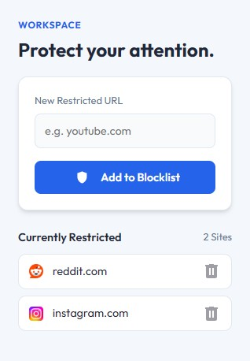

# NoGo

NoGo is designed for users who want a fast and straightforward way to restrict access to specific websites. Just enter a URL, and the site is immediately blocked. No need to configure time limits or schedules—perfect for staying focused with minimal setup.

## Installation

1. Clone this repository
2. Go to `chrome://extensions/`
3. Enable **Developer Mode**
4. Click **Load unpacked** and select the project folder

## 📄 License

This project is open-source and available under the MIT License.
